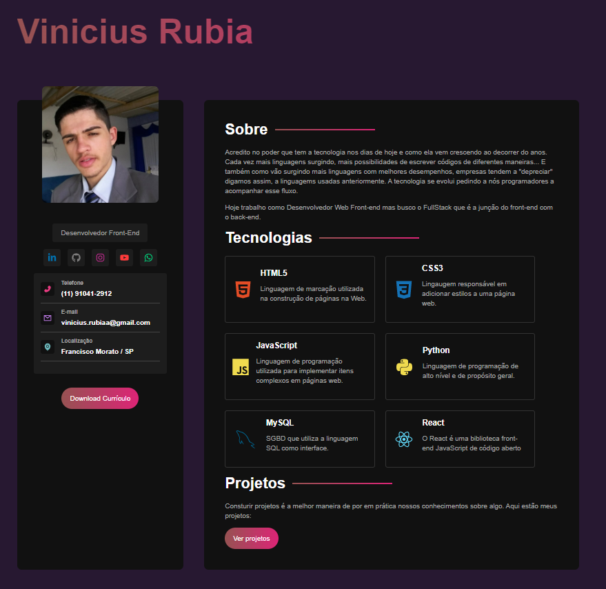
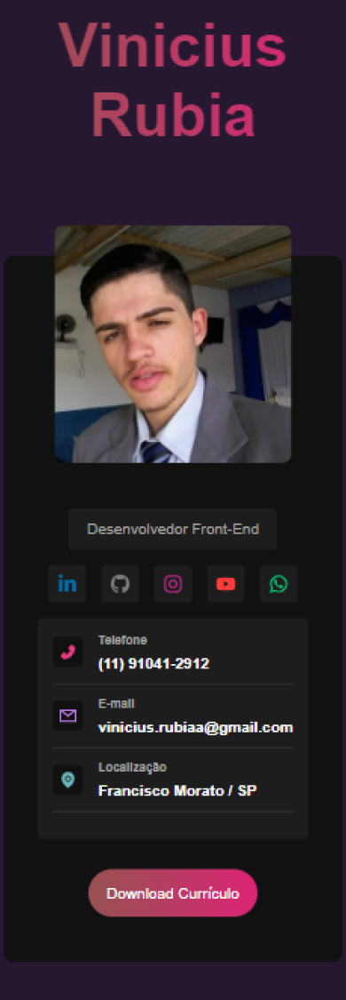
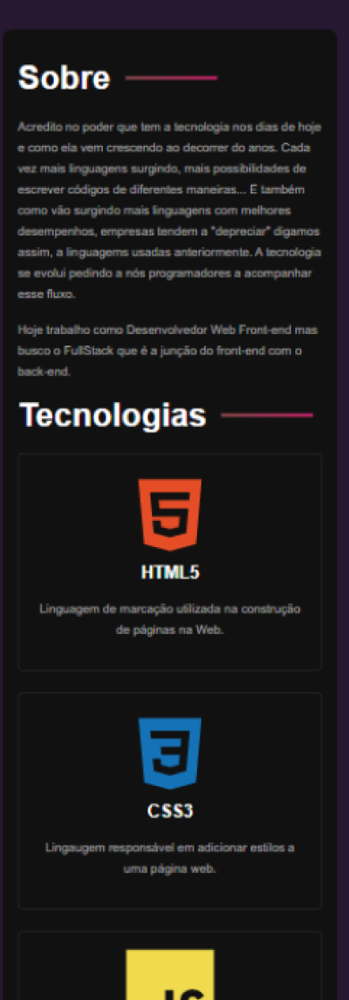

# Portfólio

O projeto consiste em um portfólio no estilo de currículo usando React com o Vite e também o micro-processador SASS

No projeto existe apenas uma página onde tem uma apresentação sobre quem está no portfólio, seu cargo e suas redes sociais, localização, formas de contato e um botão para download do currículo em PDF. Também é listado nesse projeto as tecnologias que o mesmo tem como suas habilidades e logo abaixo também tem um botão que leva ao github para ver os projetos.

O projeto também conta com a responsividade para Desktop, Tablet e versões Mobile.

## Layout - Desktop

|Desktop|
|---|
|


## Layout - Mobile

|Mobile - 1|Mobile -2|
|---|---|
| |  |

## 🚀 Começando

Pra começar, primeiro clone o repositório do projeto pra sua máquina

```
$ git clone https://github.com/Vinicius-Rubia/portfolio-react-sass.git
```

## ⚙️ Executando a aplicação

Para iniciar a aplicação, execute em seu terminal:

```
$ npm install -> Instalar todas as dependências
```

```
$ npm run dev -> Inicia a aplicação em localhost
```